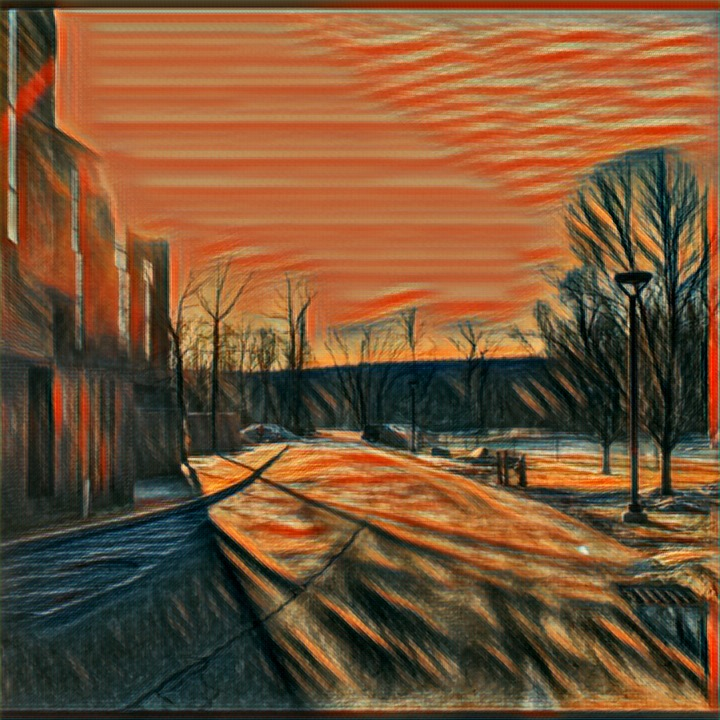
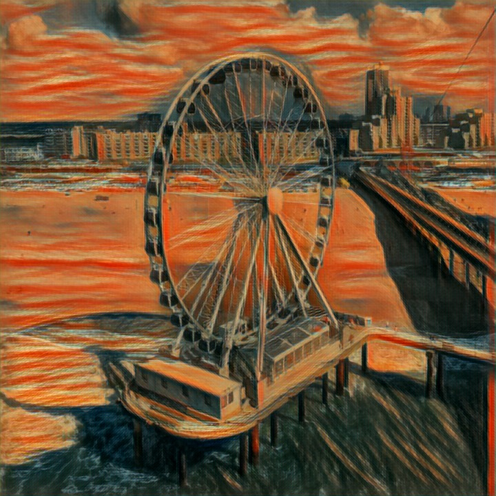

# Swift Style
Neural Style Transfer in Swift. 

**Results**:

# Pre-installation
- You must have Xcode installed
- You must be using Swift 3.2+
- Please make sure that you have the ML models. They are part of the repo. You can also download them from [here](https://coreml.store/)

# How to Run
1. Download / clone the repo.
2. Open the project in Xcode
3. Hit run!

You can also take photos (actual device required) or choose photos from your own library. You can also save the result in your photo album. 

